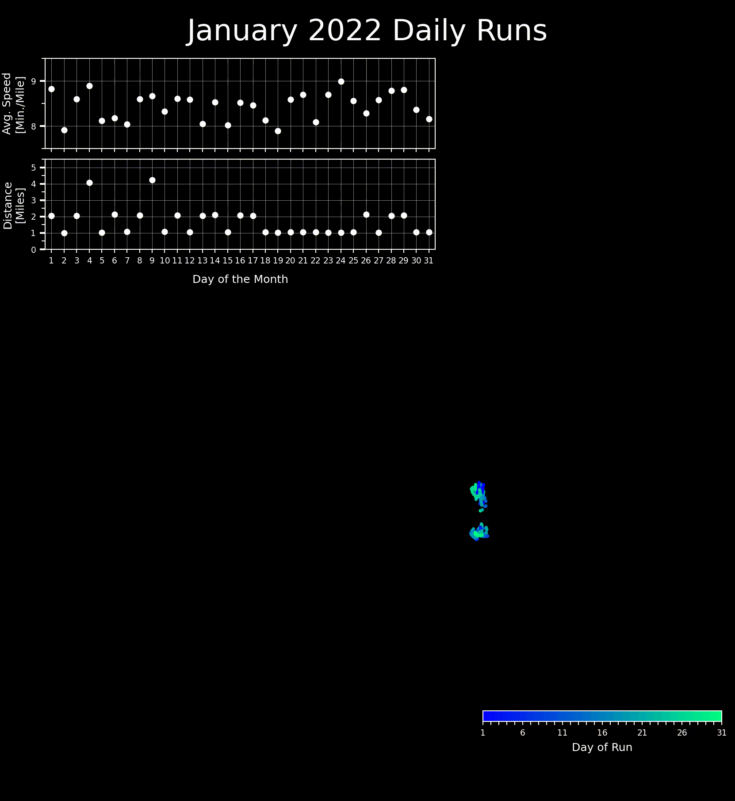
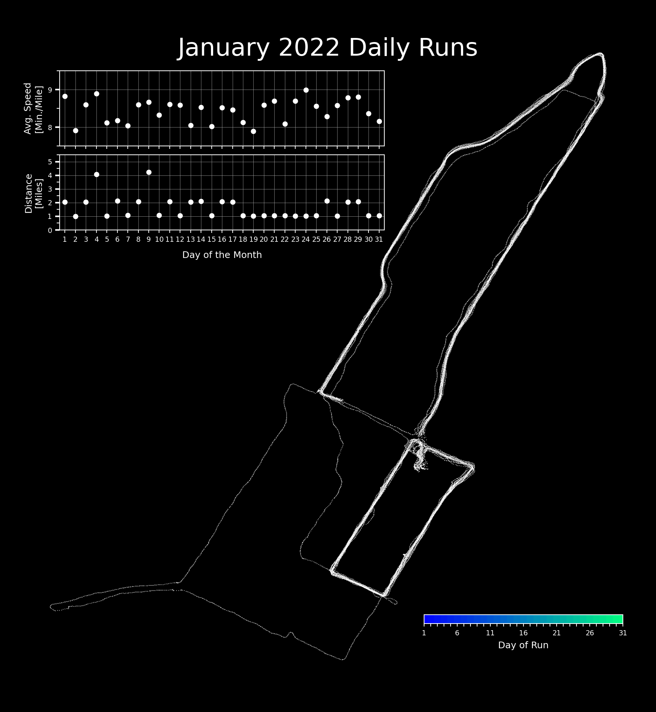

# StravaActivityVisualizer
Messy Python scripts to make a pretty visual using your Strava data

    </a>

 

## This repository contains the codes used to create the above animation

See the `requirements.txt` file for a list of the Python packages used in the included Python and Jupyter Notebook files.

### The gist of the process is the following:

1. Bulk download your Strava data ([Strava article with instructions](https://support.strava.com/hc/en-us/articles/216918437-Exporting-your-Data-and-Bulk-Export)).
2. Uncompress the downloaded file and set the `UNZIPPED_FOLDER` path in line 8 of `preprocess_data.py` to point at that uncompressed directory and then run `preprocess_data.py`. **NOTE:** The `preprocess_data.py` file is a simplified version of the `run.py` script from the [strataexport-fix](https://github.com/lhotakj/stravaexport-fix) repository. But instead of trying to convert non-GPX files, this version just deletes other GPS file formats (as this worked for my use-case).
3. Open the Jupyter Notebook `prototype_viz.ipynb` to interactively work through the notebook and create a visualization using your data. Cell 2 is where you need to update the path to your unzipped Strava data and specify the number of frames for your final animation. Interactively visualizing this data is necessary as the extents of the plot you get will depend on the activities you are plotting; and these can adversely impact the locations of the inset subplots and the colorbar on the final visual. For this reason, there is a "test plot" generated in cell block 8 which looks like the below image, giving you a chance to fiddle with the placement and size of subplots and the colorbar.

 

    </a>

 

Good luck!
